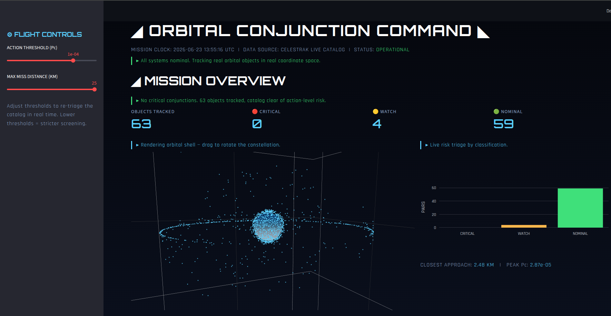

# Satellite Conjunction Assessment using HPC

Accelerating all-pairs satellite collision screening with spatial partitioning,
parallel computing, and probabilistic risk assessment — using real CelesTrak
TLE data and the SGP4 propagation model.

## What it does
A naive O(N²) screening of the ~15,830-object active catalog needs over 125
million pairwise tests per epoch. This project reduces that ~61× using spatial
methods (grid + k-d tree), parallelizes the screening, computes probability of
collision (Pc), and screens against real debris clouds. An interactive Streamlit
dashboard ties it together.

## Structure
- `dashboard.py` — Interactive mission-control dashboard (Streamlit)
- `requirements.txt` — Python dependencies
- `pipeline/` — The 19 phase scripts (data → screening → analysis)
- `data/` — Generated data (JSON results, propagated positions)
- `outputs/` — Figures (PNG)
- `reports/` — Conjunction reports (CSV, TXT)
- `paper/` — IEEE-format research paper

## Setup
python3 -m venv venv
source venv/bin/activate
pip install -r requirements.txt

## Run the pipeline (from the project root)
python3 pipeline/phase1_fetch.py
python3 pipeline/phase2_propagate.py
python3 pipeline/phase3_naive.py
python3 pipeline/phase4_smart.py
python3 pipeline/phase8_parallel_screening.py
python3 pipeline/phase9_fullcatalog.py
python3 pipeline/phase11_collision_probability.py
python3 pipeline/phase13_operational.py
python3 pipeline/phase14_protected_asset.py
python3 pipeline/phase15_approach_curve.py
python3 pipeline/phase16_debris.py

Run scripts from the project root so relative paths (data/, outputs/) resolve.

## Run the dashboard
streamlit run dashboard.py

## Key results
- ~61× fewer comparisons than naive, with identical close-pair sets (zero false negatives)
- Near-ideal parallel speedup to 4 cores; efficiency knee beyond 8 (Amdahl's law)
- Risk-based prioritization: the riskiest pair is not always the closest
- Real debris screening: a current Starlink satellite within ~4.4 km of 2009 Iridium-33 debris

## Author
Aditya Rajendra Sonawane — M.Sc. High Performance Computing & Quantum Computing,
Technische Hochschule Deggendorf, Germany

